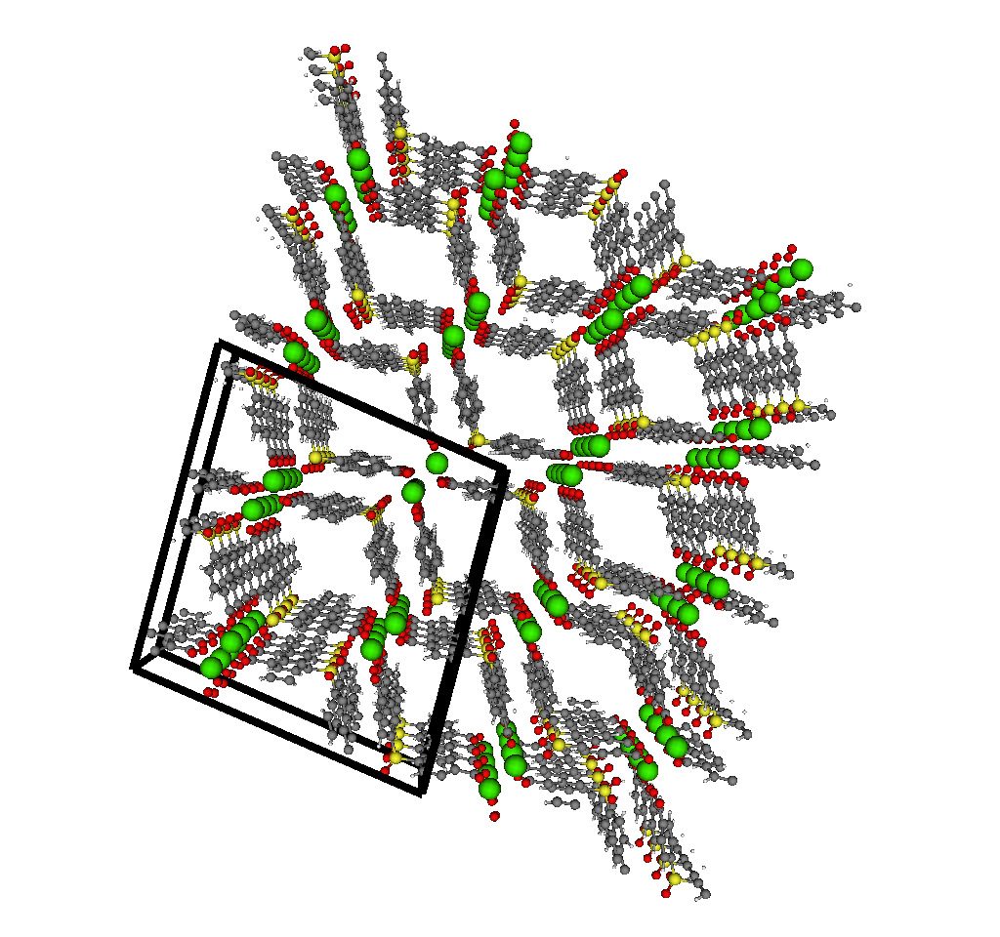

# Molecule visualization

Example structure: SBMOF-1.

Goal of visualization:


The unit cell box is described by `unitcellboundary.vtk`

The atom types and their Cartesian coordinates are described in `SBMOF1.xyz`.

To read these into Julia, I wrote `reader.jl`:

```
include("reader.jl")

i = 1 # first atom

atoms[i] # gives element type
x[:, i] # gives Cartesian coordinate of element i
atom_colors[i] # gives color atom i should be in visualization (RGB tupble)
atom_radii[i] # gives radius of atom i (usually these are scaled in visualization)
```

### Bonding rules

Should the user specify the bonding rules, i.e. a list of which atoms are bonded? What is a good format? Just a list of edges? e.g.

`bonds.txt`
```
1 2 # atom 1 is bonded with atom 2
4 9 # atom 4 is bonded with atom 9
```

?

One typically needs to tune the bonding rules in a visualization.
Default bonding rules are:

Let X be any atom. Let Y be any other atom.

If atom Y is hydrogen H: if distance between Y and X is less than 1.2, create a bond.

If atom Y is any other atom type: if distnace between X and Y is less than 1.9, create a bond.
